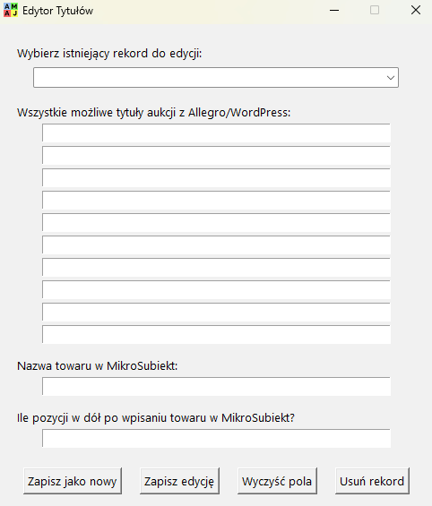

<div align="center">

# 📑 Quick Receipt
Automatyzacja generowania i wprowadzania paragonów / faktur z Allegro & WooCommerce do MikroSubiekt ⚡

<sub>Rozszerzenie przeglądarki + skrypty Python = mniej klikania ➜ mniej błędów ➜ szybsza obsługa zamówień.</sub>

---

  

</div>

<p align="center">
  
</p>

## 📌 Jak to działa?

1. W panelu Allegro / WordPress pojawiają się przyciski (iniekcja content scriptu).  
2. Kliknięcie „Przygotuj Paragon” / „Przygotuj Fakturę” generuje plik(i): `paragon.txt` (+ opcjonalnie `faktura.txt`).  
3. Pliki lądują w katalogu Pobrane (monitorowany przez Paragoniarkę).  
4. `skrypt.pyw` parsuje dane i symuluje: wpisy tytułów → wybór towaru → ilość → cena → (jeśli faktura) dane kontrahenta.  
5. Słownik `titles.json` mapuje „warianty tytułów” → skróty towarów + ile strzałek w dół nacisnąć.  
6. Sygnał dźwiękowy: ✅ `done.mp3` / ❌ `error.mp3` (brak dopasowania).  
7. Edytor `title_creator.pyw` służy do rozbudowy słownika bez ręcznej edycji JSON.

> 💡 Jeśli pojawi się błąd dopasowania – otwórz edytor, dodaj nowy wariant tytułu, zapisz i wygeneruj ponownie.
> 
> Chcesz wersję bez wtyczki (API + Dashboard zamówień z Allegro i WooCommerce w jednym miejscu)? → użyj repo `simple-allegro` (tworzy te same pliki `paragon.txt` / `faktura.txt`).

### Alternatywa: API (`simple-allegro`)

- To repo (`quick-receipt`) = scraping DOM + ergonomiczne przyciski.  
- Repo `simple-allegro` = REST API Allegro & WooCommerce → generacja tych samych plików bez rozszerzenia.  
Oba feedują ten sam pipeline w Pythonie.

## ⚖️ Porównanie: Dashboard z API vs Sama Wtyczka

| Cecha | `simple-allegro` (API) | `quick-receipt` (wtyczka) |
|-------|------------------------|---------------------------|
| Rozszerzenie przeglądarki | ❌ | ✅ (przyciski Paragon/Faktura + narzędzia) |
| Źródło danych | REST API Allegro / Woo | DOM stron (scraping) |
| Pliki wyjściowe | `paragon.txt` / `faktura.txt` | `paragon.txt` / `faktura.txt` |
| Dane fakturowe | Z API | Parsing HTML (otwarta karta Allegro) |
| BLPaczka | Własna implementacja | Wbudowane (cache w storage)* |
| Odporność na redesign | Wysoka | Niższa (zmiany klas CSS) |
| Konfiguracja startowa | Klucze API | Instalacja rozszerzenia + ułożenie okien |
| Edytor słownika | Ręcznie / własny | Wbudowany GUI |
| Największa zaleta | Stabilność backendu | Zero integracji po API potrzebne |
| Największe ryzyko | Limity / autoryzacja | Zmiana layoutu Allegro/WP |

*Integracja BLPaczka – od niedawna nie działa (nie była mi potrzebna, więc nie naprawiałem:/).

## 🛠️ Komponenty

| Komponent | Opis |
|-----------|------|
| `extension/` | Wtyczka do przeglądarki |
| `app/skrypt.pyw` | Paragoniarka – GUI statusu + symulacja wpisywania |
| `app/title_creator.pyw` | Edytor słownika towarów |

## 🧩 Wymagania (część Python)

- Windows (symulacja GUI: `pyautogui`, `keyboard` – stałe współrzędne ekranu)
- Python 3.13+
- Pakiety: `pygame`, `pyautogui`, `keyboard`, `unicodedata` (wbud.), `json`, itd. *(warto dodać `requirements.txt`)*
- MikroSubiekt otwarty w lewym górnym rogu (nie zasłaniać go, brak skalowania DPI > 125% jeśli możliwe)
- Skonfiguruj w pliku `app/skrypt.pyw` (linijki z `paragon_path` i `faktura_path`) własną ścieżkę katalogu pobierania — musi wskazywać dokładnie miejsce, gdzie przeglądarka zapisuje `paragon.txt` / `faktura.txt`.
	```python
  18. paragon_path = 'C:/Users/kamil/Downloads/paragon.txt'
  19. faktura_path = 'C:/Users/kamil/Downloads/faktura.txt'
	```

## 🧪 Instalacja rozszerzenia

1. Chrome / Edge → `chrome://extensions` / `edge://extensions`
2. Włącz „Tryb deweloperski”.
3. „Załaduj rozpakowane” → wskaż folder `extension/`.
4. Upewnij się, że pobieranie plików nie pyta o lokalizację (automatyczny zapis do Pobrane).

## 🚀 Użycie

1. Uruchom Paragoniarkę: `app/skrypt.pyw`.
2. Ustaw okno MikroSubiekta maksymalnie do lewego górnego rogu ekranu.
3. Wejdź w zamówienie Allegro lub WooCommerce.
4. Kliknij „Przygotuj Paragon” (lub „Przygotuj Fakturę”).
5. Obserwuj autouzupełnianie w MikroSubiekt.
6. Jeśli błąd (sygnał) → dopisz wariant w edytorze tytułów.

> 🔁 Możesz powtórzyć proces bez restartu – Paragoniarka czyści stan po każdym paragonie.

## ✏️ Edycja słownika tytułów (`titles.json`)



1. Otwórz `title_creator.pyw` (albo przycisk „Edytuj tytuły”).
2. Dodaj warianty tytułów (bez polskich znaków – będą normalizowane).
3. Ustaw skrót (użyjesz w MikroSubiekcie).
4. `ile_w_dol` = ile razy nacisnąć ↓ przed Enter.
5. Zapisz i przetestuj.
   
> 🧠 Warto dodać najpierw najkrótsze i najbardziej charakterystyczne warianty.

<br clear="right" />

## 🧾 Dane faktury

Allegro: wykrycie faktury → otwarcie osobnej karty → parsowanie → zapis `faktura.txt` → wprowadzenie danych kontrahenta po wprowadzeniu paragonu.  
WordPress: brak generacji faktury (obsługiwanie tylko paragonu).  

## 🔐 Bezpieczeństwo / Ograniczenia

- Brak walidacji NIP / numerów telefonu.
- Stałe współrzędne myszy – zmiana layoutu / DPI / monitorów = potrzeba dostosowania.
- Zależne od klas CSS i struktury stron (kruchość przy redesignie Allegro / WooCommerce).

## ⚠️ Uwagi operacyjne

- MikroSubiekt: okno nieruchome (lewy górny róg) – inaczej kliknięcia trafią w złe pola.
- DPI systemowe >125% może zaburzać pozycje – testuj.
- Przy wielu monitorach: ustaw główny jako docelowy.
- Od czasu do czasu sprawdzaj czy selektory w `content.js` nadal działają.

## 🛠️ Debug / szybki test

1. Usuń poprzednie `paragon.txt` z Pobrane.
2. Kliknij przycisk Paragon w Allegro.
3. Otwórz DevTools → Console → sprawdź log „Zebrane dane z zamówienia”.
4. Sprawdź, czy Paragoniarka zareagowała (diody + tabela).

---

<sub>Masz sugestię albo chcesz dodać integrację z inną platformą? Otwórz issue lub wyślij PR. ✨</sub>

